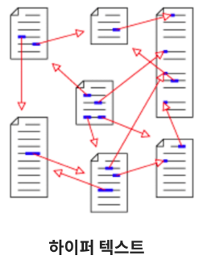
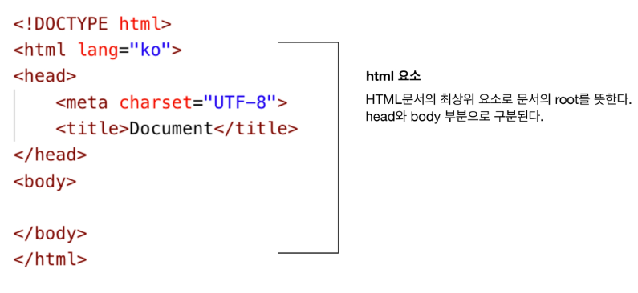

- 클라이언트 <------> 서버
- IP : 고유 주소
- 도메인 : 사람이 보기에 복잡한 주소 대신 쓰는 가짜 주소
- URL : 해당 서버에 저장된 자료의 위치

# HTML
- 
- Hyper Text Markup Language의 약자
- Web의 뼈대를 담당한다.(중요)
- Text를 클릭하면 주소를 보여준다.
- W3C - 웹 표준 사이트, 모르는게 있으면 여기서 찾아본다.

1. HTML 문서의 기본 구조

   

get 요청 : 서버로 부터 문서파일 하나를 받아서 보여준다.
post 요청: 클라이언트가 보낸 정보를 받아서 서버에 저장한다.

### 실습 
- table 만들기
- 동영상 넣기
- 점심메뉴판 만들기
- 서브웨이 주문서 만들기 

## CSS
- HTML에서 만든 뼈대를 디자인하여 꾸며주는 역활

## javascrip
- 동적인 움직임을 더해주는 역활